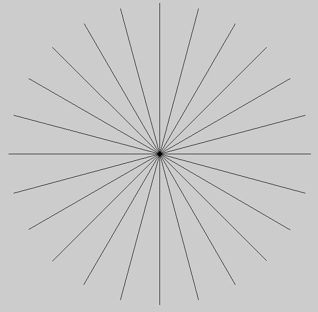
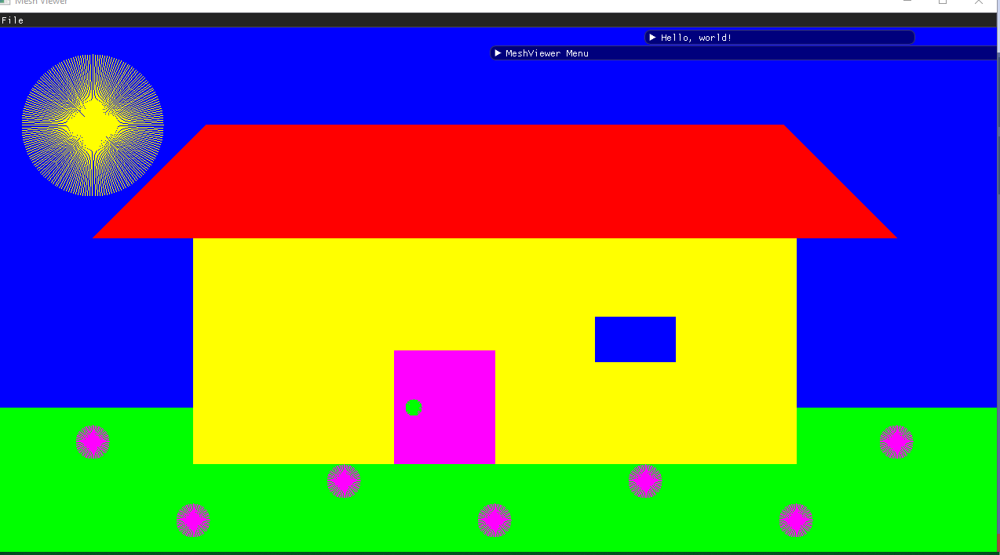

# Assignment 1 - Part 1

## Code implementation:

```
void Renderer::DrawLine(const glm::ivec2 &p1, const glm::ivec2 &p2, const glm::vec3 &color) {
    TypeOfLine type;
    glm::ivec2 temp1(p1),temp2(p2);
    if(temp1[0]>temp2[0] || (temp1[0]==temp2[0] && temp1[1]>temp2[1]))  //swap so that we would always draw from left to right.
        std::swap(temp1,temp2);
    GLint dx=temp2[0]-temp1[0],dy=temp2[1]-temp1[1]+0.5; //     0.5 to fix rounding of negative numbers.
    if(dy>=0){                  //drawing from down to up.
        if (dy<=dx)             //x-step is bigger then y-step
            type=BASIC;         //basic taught function
        else
            type=SWAP_ROLES;    //swap x and y roles
    }
    else{                       // drawing from up to down
        if(abs(dy)<=abs(dx))     // x-step is bigger then y-step
            type=REFLECT;       // then we just reflect on x axis.
        else        // both y step is bigger then x step and we draw from up to down,so we swap roles and reflect.
            type=SWAP_N_REFLECT;
    }
    switch(type){
        case BASIC:
            DrawBasic(temp1, temp2, color); break;
        case SWAP_ROLES:
            DrawSwap(temp1, temp2, color); break;
        case REFLECT:
            DrawReflect(temp1, temp2, color); break;
        case SWAP_N_REFLECT:
            DrawSNR(temp1, temp2, color); break;
    }
}

void Renderer::DrawBasic(const glm::ivec2 &p1, const glm::ivec2 &p2, const glm::vec3 &color) {
    GLint d_y = p2[1] - p1[1];
    GLint d_x = p2[0] - p1[0];
    GLint x = p1[0], y = p1[1];     // starting point
    GLint error = -d_x;
    while (x <= p2[0]) {
        if (error > 0) {
            y++;
            error -= 2 * d_x;
        }
        PutPixel(x, y, color);
        x++;
        error += 2 * d_y;
    }
}

void Renderer::DrawSwap(const glm::ivec2 &p1, const glm::ivec2 &p2, const glm::vec3 &color) {
    GLint d_y = p2[1] - p1[1];
    GLint d_x = p2[0] - p1[0];
    GLint x = p1[0], y = p1[1];     // starting point
    GLint error = -d_y;
    while (y <= p2[1]) {
        if (error > 0) {
            x++;
            error -= 2 * d_y;
        }
        PutPixel(x, y, color);
        y++;
        error += 2 * d_x;
    }
}

void Renderer::DrawReflect(const glm::ivec2 &p1, const glm::ivec2 &p2, const glm::vec3 &color) {
    GLint d_y = p2[1] - p1[1];
    GLint d_x = p2[0] - p1[0];
    GLint x = p1[0], y = p1[1];     // starting point
    GLint error = -d_x;
    while (x <= p2[0]) {
        if (error > 0) {
            y--;
            error -= 2 * d_x;
        }
        PutPixel(x, y, color);
        x++;
        error -= 2 * d_y;
    }
}

void Renderer::DrawSNR(const glm::ivec2 &p1, const glm::ivec2 &p2, const glm::vec3 &color) {
    GLint d_y = p2[1] - p1[1];
    GLint d_x = p2[0] - p1[0];
    GLint x = p1[0], y = p1[1];     // starting point
    GLint error = d_y;
    while (y >= p2[1]) {
        if (error > 0) {
            x++;
            error += 2 * d_y;
        }
        PutPixel(x, y, color);
        y--;
        error += 2 * d_x;
    }
}
```

Whereas ```TypeOfLine``` is just a simple enum:
```
enum TypeOfLine{BASIC,SWAP_ROLES,REFLECT,SWAP_N_REFLECT};
``` 

## Sanity check:

## Drawing:


