# Assignment 1 - Part 3

###1. Loading a mesh and rotating around Y axis of the world:
##### 0 deg:
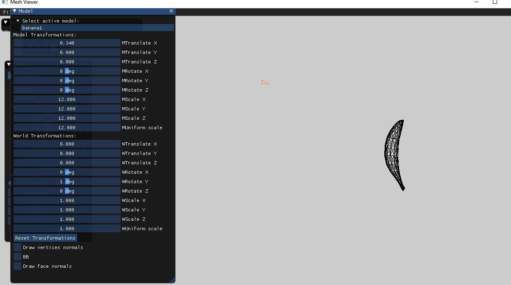
##### 45 deg:
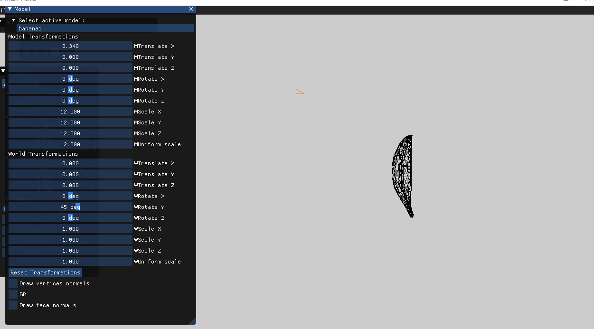
##### 90 deg:
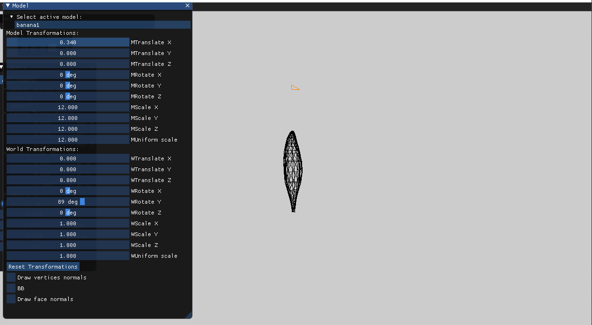
##### 135:
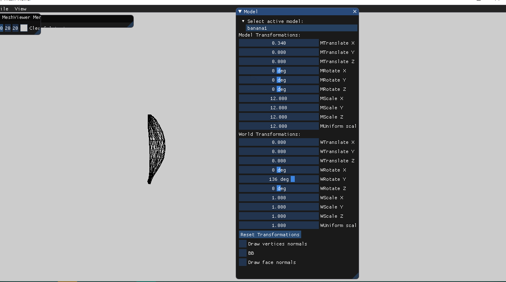

###2. 
##### Translate on model, rotate on world:
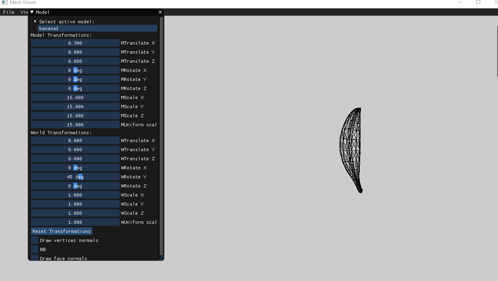
##### Translate on world, rotate on model:
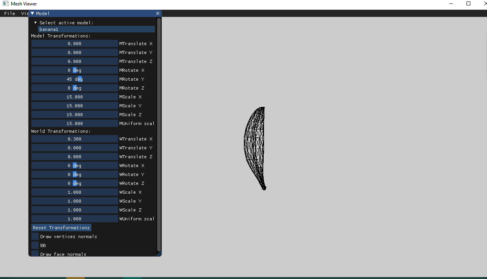

###3. Bounding box, Face normals and Vertex normals:
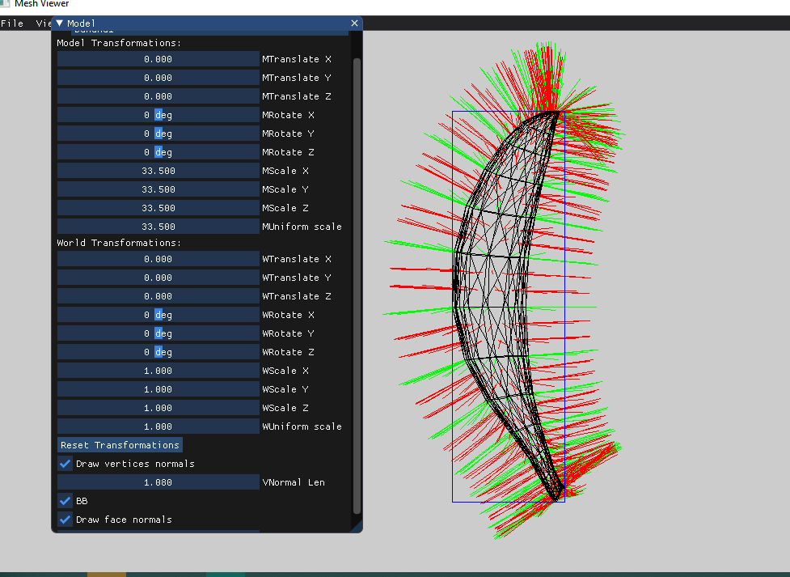
##### Bounding box in perspective:
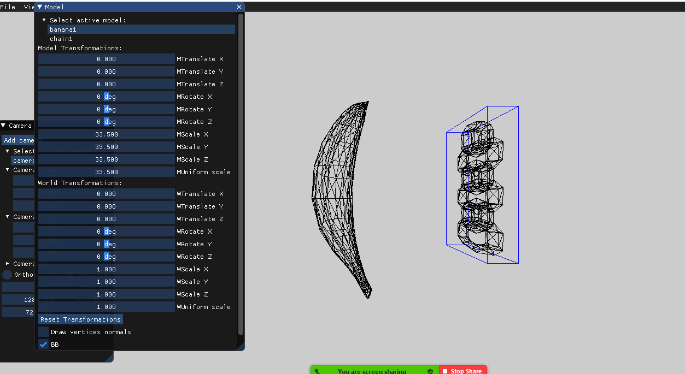

###4. Comparison between Orthographic and Perspective Projection
##### Orthographic camera
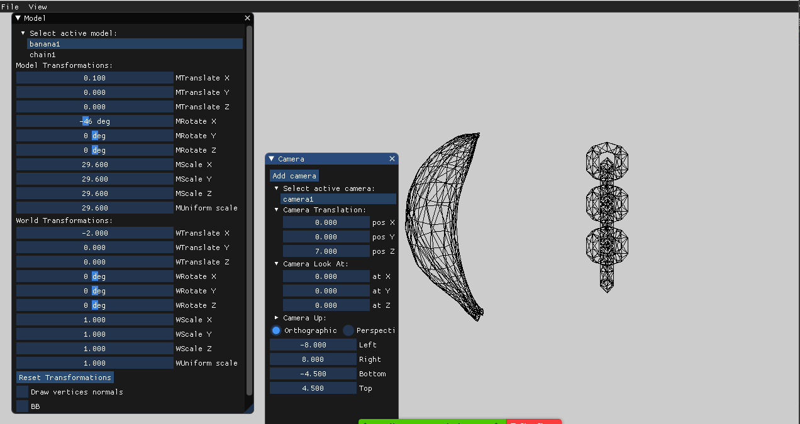
##### Perspective camera
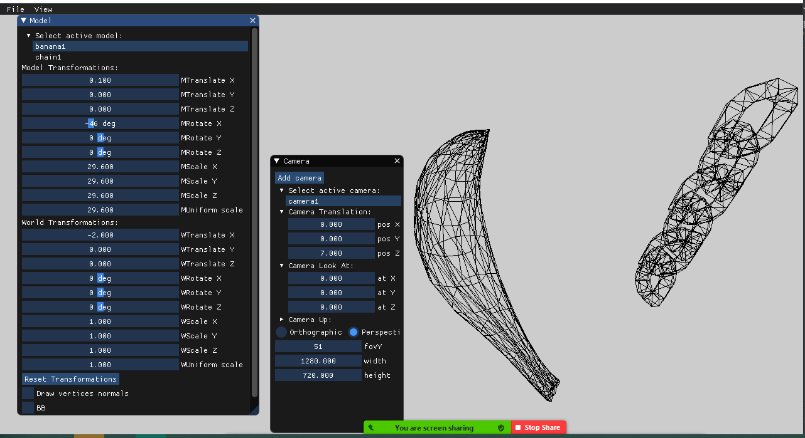

###5. Difference between zoom and getting closer in perspective

##### Initial State:
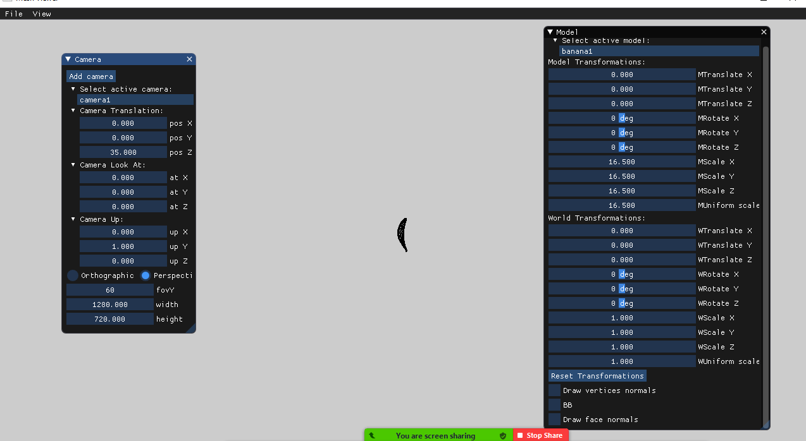
##### Setting the camera closer:
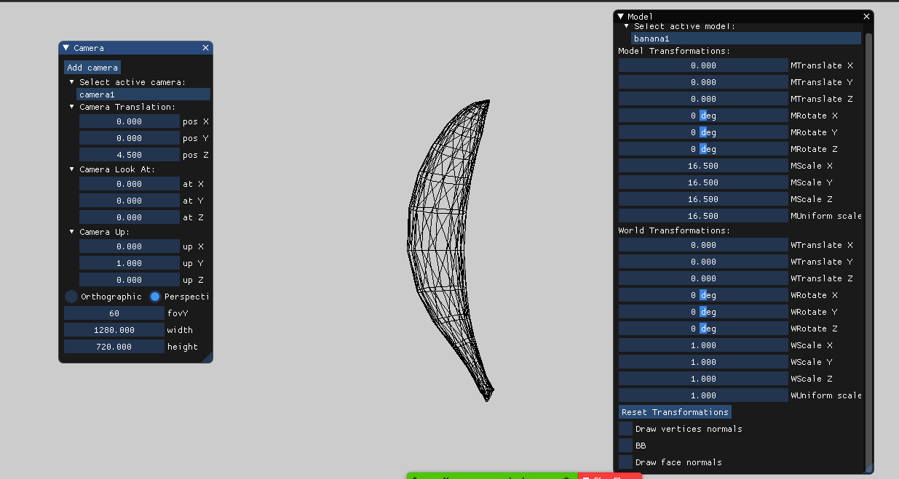
##### Zooming(Changing frustum):
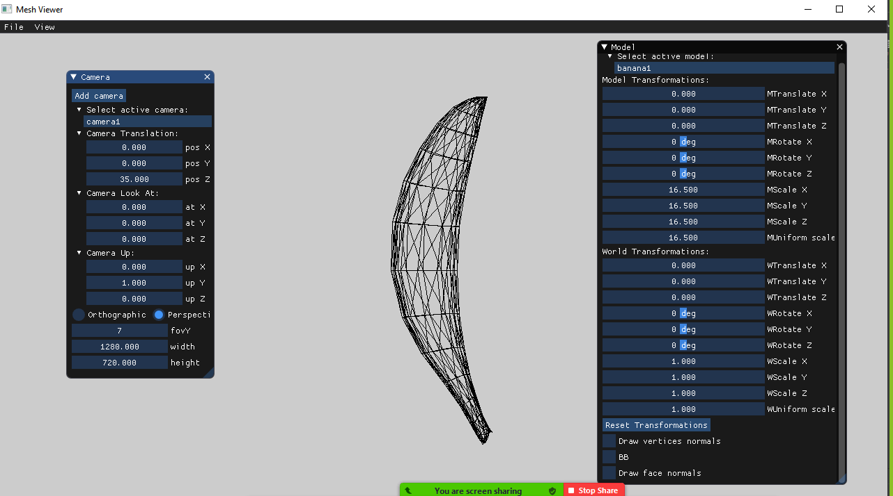

###6. camera rotation
we did not have enough time to implement camera rotations 

###7.Camera LookAt:
We can see that the camera is located somewhere on axis X but the LookAt is aimed on the location of the model, explaining why we see it from the side:
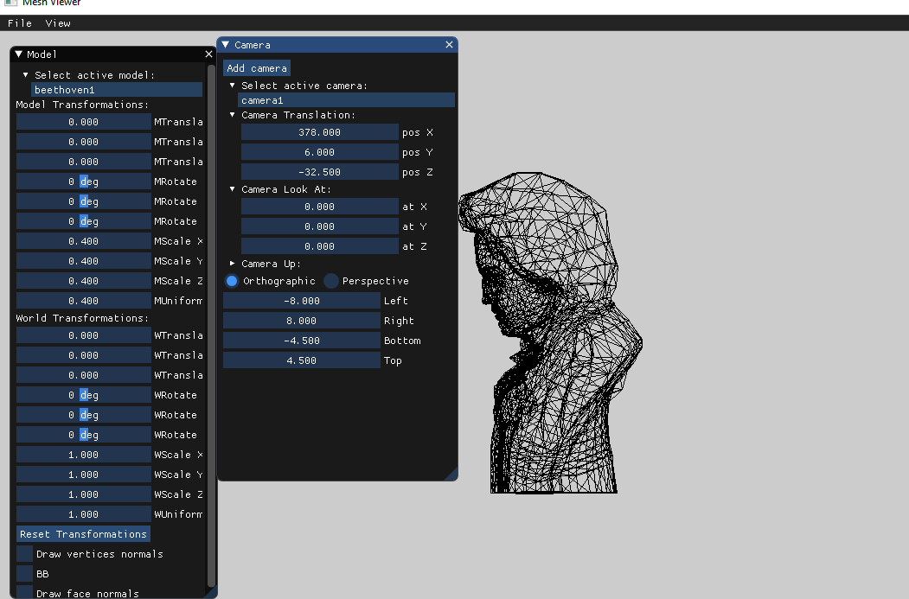

###8. Multiple models and cameras
we did not have enough time to implement camera rendering, but we can switch between multiple cameras easily
##### camera1:
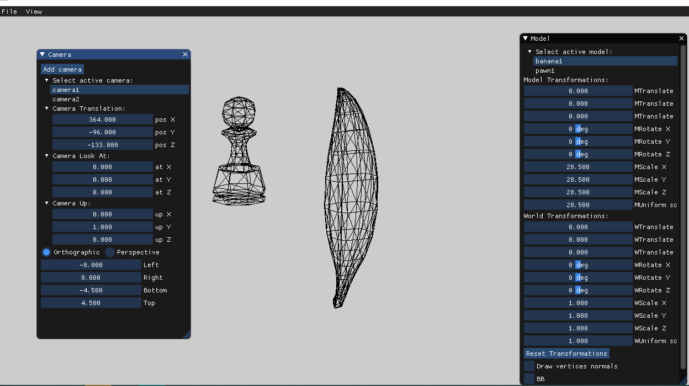
##### camera2:
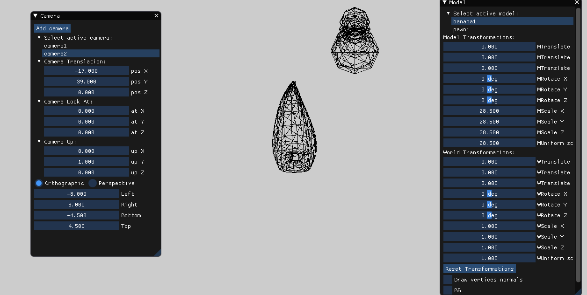

###9. Resized window maintains the ratio aspect
we did not have enough time to implement the ratio aspect maintaining

###10. GUI
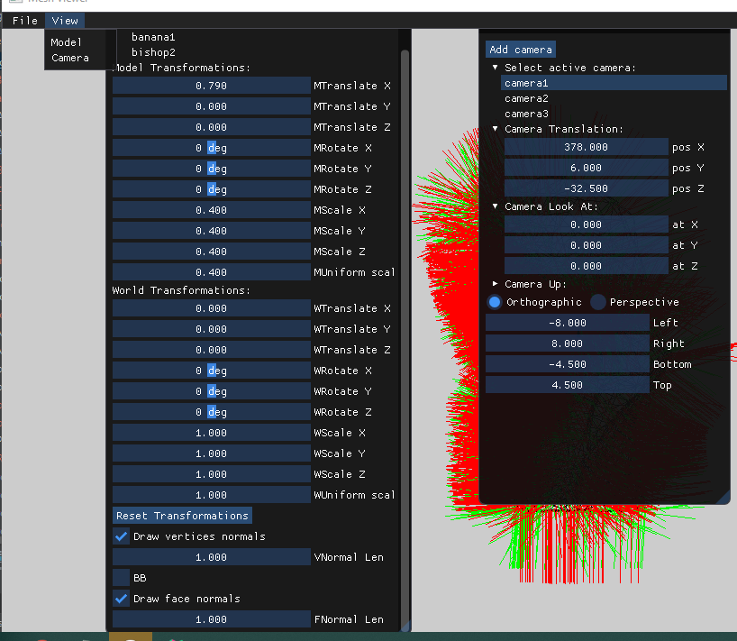

###11. Additional Features
we did not really had enough time to implement an additional feature, only added the option to resize the normal length