# Assignment 2 - Part 1

##1.
I've decided to go for a scanline approach, scanning through a bounding box for each triangle,and for each point in the bounding box, i've checked whether the pixel is in the triangle or not.
The triangle check is done by looking at which side of the line equation is the point,
returning true only when each of the line functions have a positive result.

Snapshots:

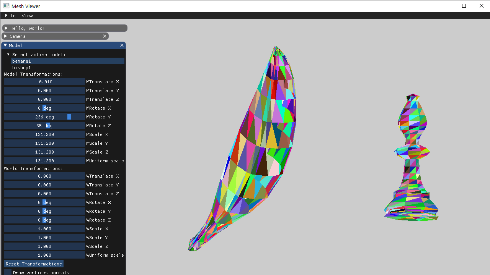

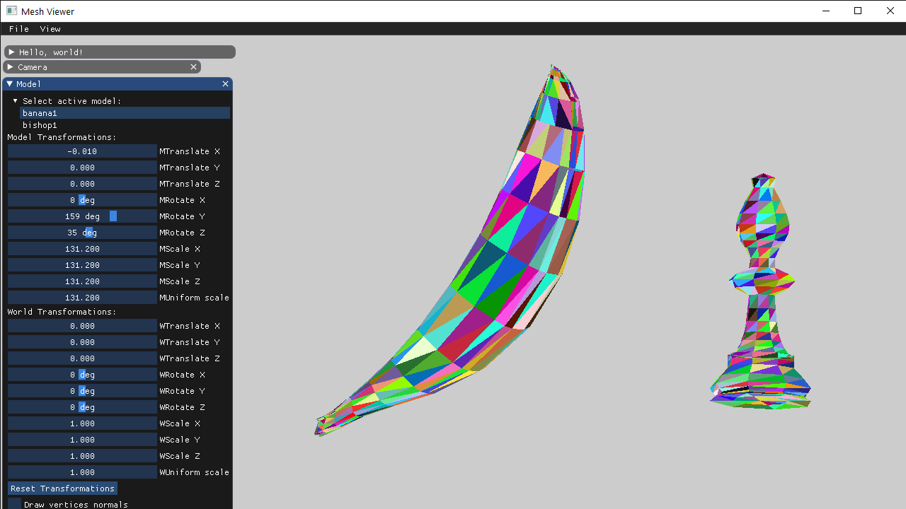

##2.
After implementing the z-buffer:

No Depth Image:

Depth Image:

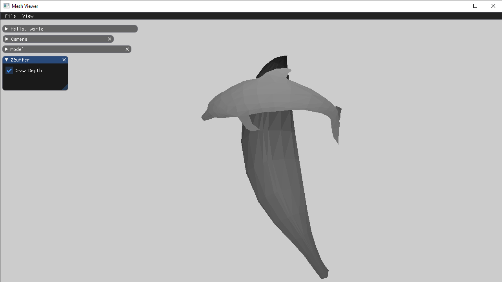

#Adding a few more examples in case not enough:
Depth Images from different cameras:
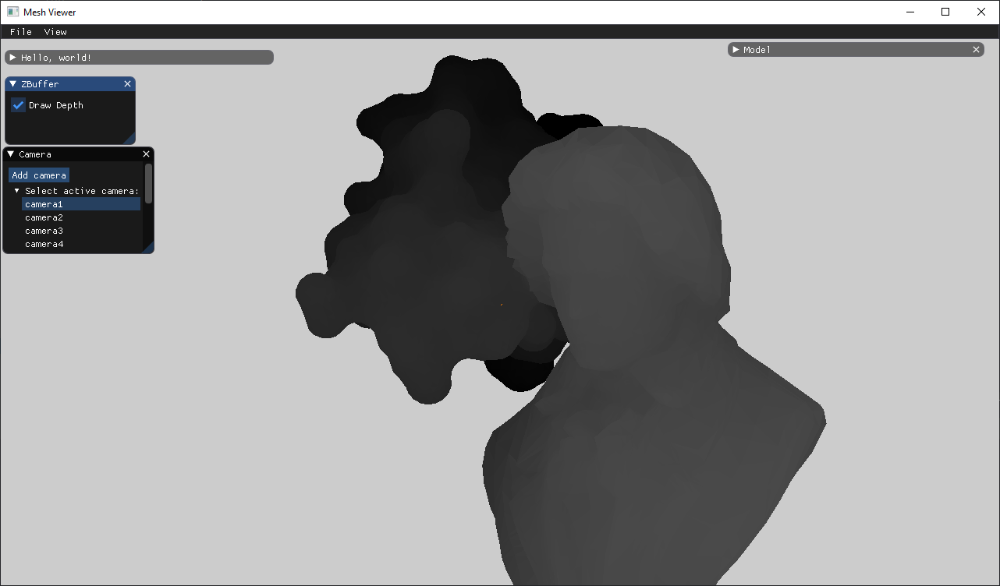
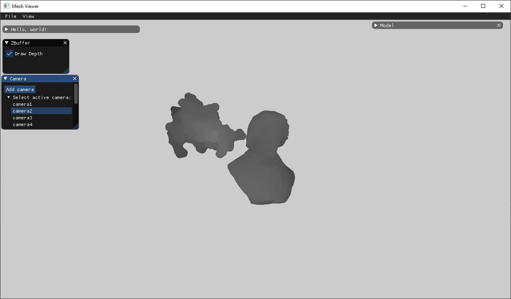
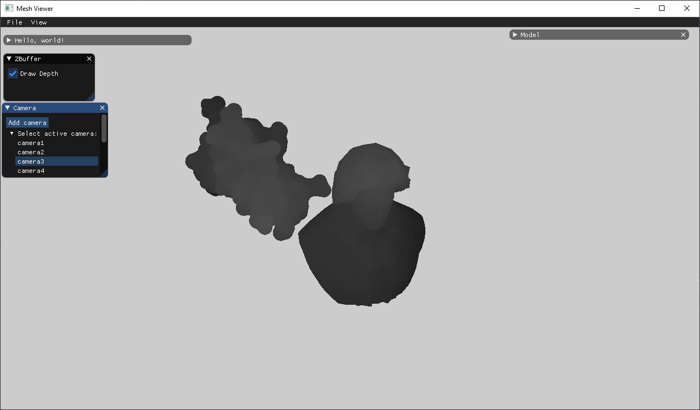
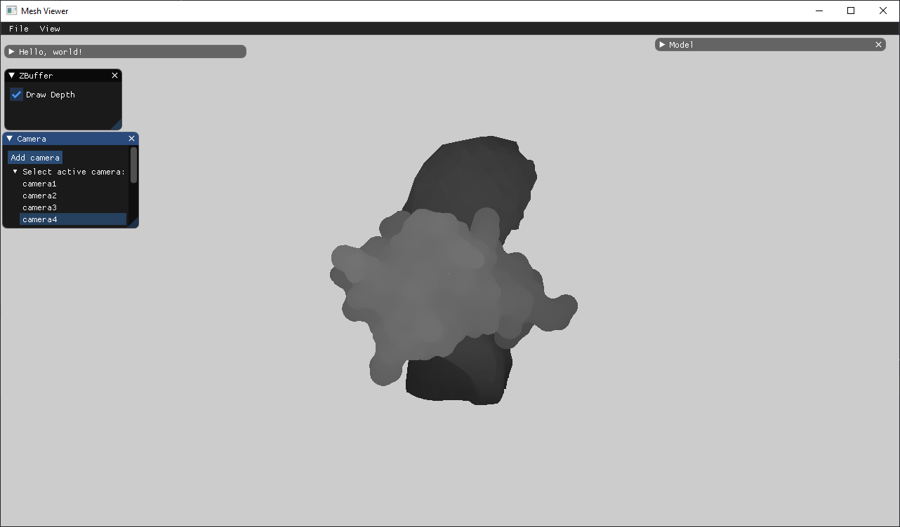

Regular Images from different cameras:
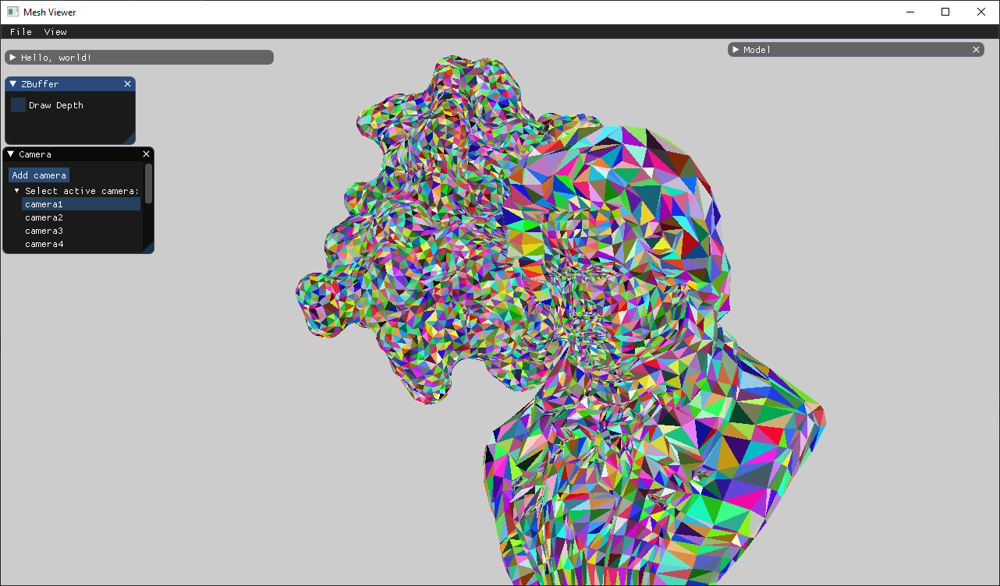
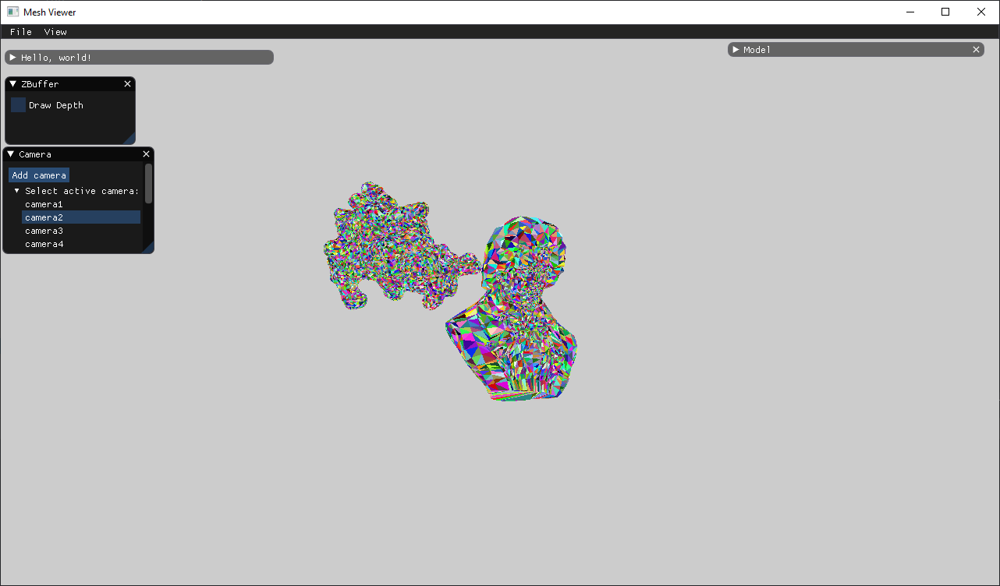
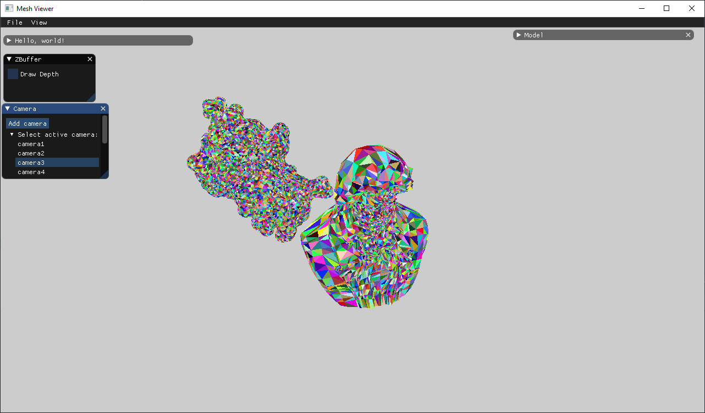
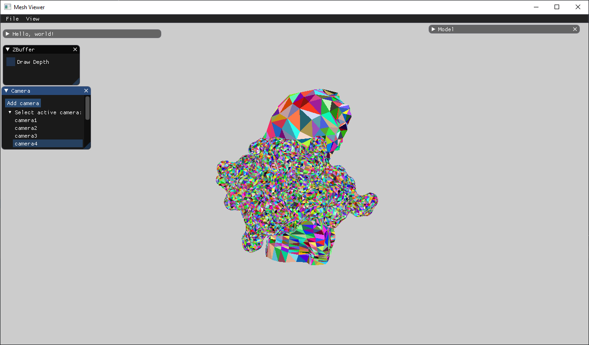

####Bonus:
Beethoven revolving around the banana:

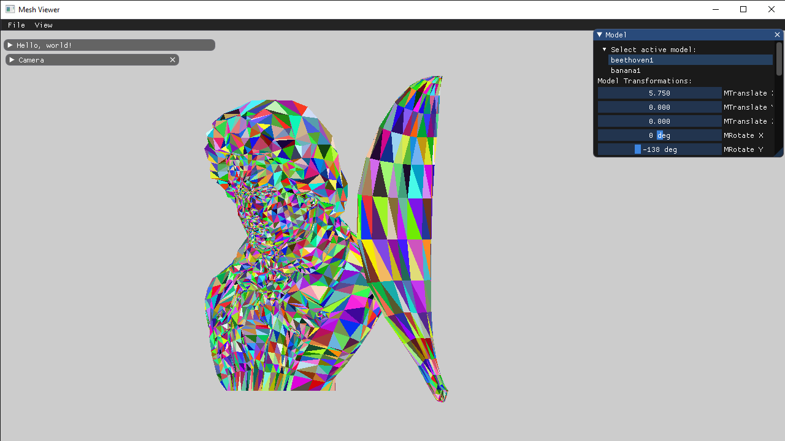
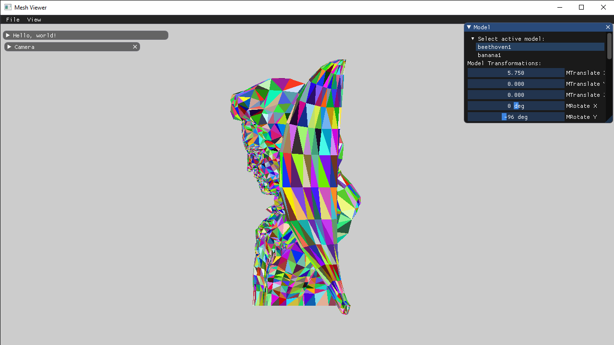
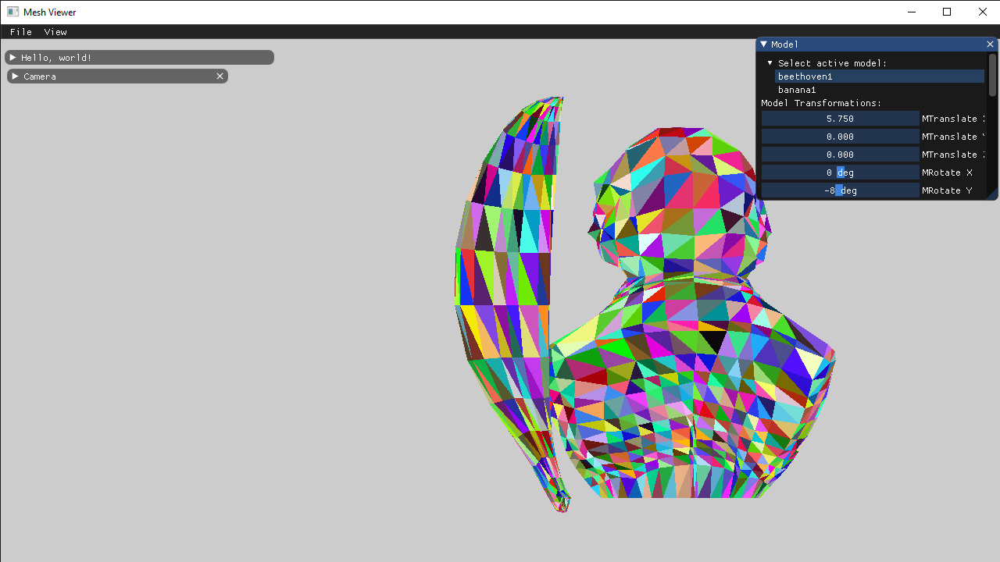
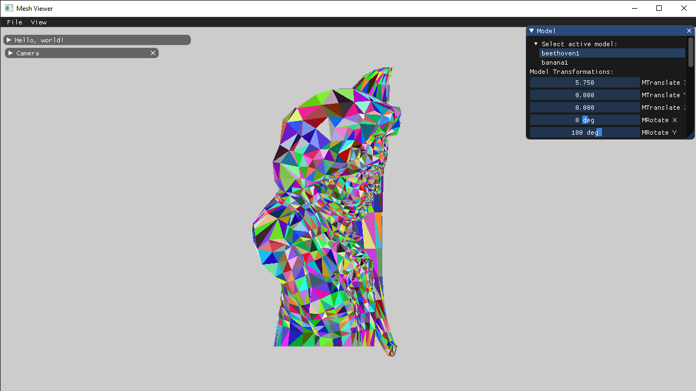
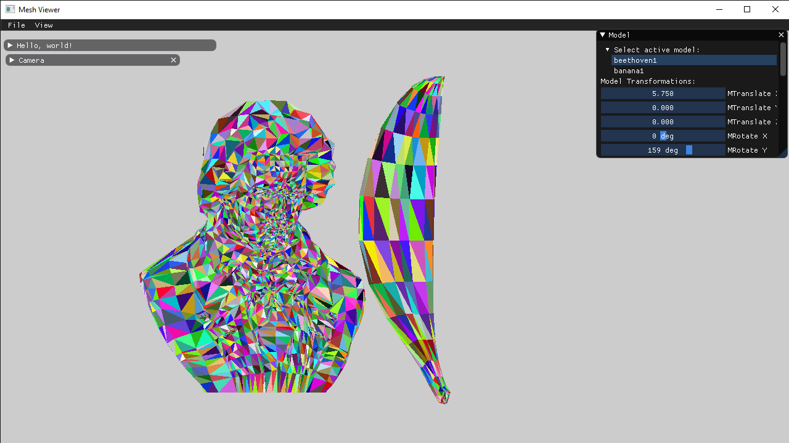