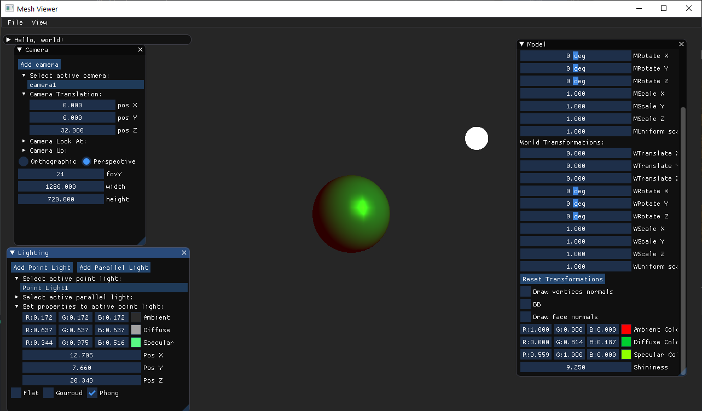

# Assignment 3

##1.

I will start by describing the ```Renderer::InitOpenGLRendering()```:

1. Assign a unique ID for a texture and a vertex array.
2. Generate a buffer to store both of these objects.
3. Create 2 (static) triangles that cover our entire screen,with corresponding texture UV coordinates for these vertices.
4. Bind the buffer in the context of an array of data.
5. Now that the buffer is ready:
    1. Transfer the vertices coordinates data to the buffer.
    2. Transfer the uv coordinates of each vertex to the buffer.
    
6. Initialize both vertex and fragment shaders and let OpenGL know to use them.
7. Send vertex position and texture position as an attribute to the GPU.
8. Finally, pass the texture to the shader.

As for the ```Renderer::SwapBuffers()```:
Passes the `color_buffer_` as an "image" to the texture created beforehand which will be finally drawn on the screen.

##3.

Seems like the example's code executes most of the basic functionality of a vertex shader,
it has all the transformations passed down to it, and the gl_position is just the transformed vertices.
The normals weren't passed down to the fragment shader properly,it should have been the transpose of the inverse of the model view matrix.

Code:
```glsl
layout(location = 0) in vec3 pos;
layout(location = 1) in vec3 normal;

// The model/view/projection matrices
uniform mat4 model;
uniform mat4 view;
uniform mat4 projection;

// These outputs will be available in the fragment shader as inputs
out vec3 orig_fragPos; // original vertex,just in case it's needed later on.
out vec3 fragPos;      // vertex after model transformation,just in case it's needed later on.

void main()
{
   // Apply the model transformation to the 'position' and 'normal' properties of the vertex,
   // so the interpolated values of these properties will be available for usi n the fragment shader
   mat4 mv = view*model;
   orig_fragPos = vec3(vec4(pos, 1.0f));
   fragPos = vec3(model * vec4(pos, 1.0f));
   fragNormal = transpose(inverse(mv)) * normal;    // for lighting later on.
   
   // This is an internal OpenGL variable, we must set a value to this variable
   gl_Position = projection * view *  model * vec4(pos, 1.0f);
}
```

##4.
For each (interpolated) point on the triangle, we just need to draw in one simple color.
Code:
```glsl
#version 330 core

in vec3 fragPos;        //currently unused.
in vec3 fragNormal;     //currently unused.
in vec3 orig_fragPos;   //currently unused.

out vec4 frag_color;    //output color for each pixel.

void main()
{
    frag_color = vec4(0,1,0,1); //Green for example.
}
```

##5.

We can now see clearly the mesh.
Code:
- In the Renderer:
   ```c++
   void Renderer::Render(const Scene &scene) {
    int cam_count = scene.GetCameraCount();
    Scene& scene_ = const_cast<Scene&>(scene);
    if(cam_count > 0){
        int model_count = scene.GetModelCount();
        const Camera& camera = scene_.GetActiveCamera();
        glm::mat4 view = GetViewTransform(camera);
        glm::mat4 projection = GetProjectionTransform(camera);
        for (int i = 0; i < model_count; ++i) {
            MeshModel& meshModel = scene_.GetModel(i);
            glm::mat4 model = meshModel.GetTransform();

            // Activate the 'colorShader' program (vertex and fragment shaders)
            colorShader.use();

            // Set the uniform variables
            colorShader.setUniform("model", model);
            colorShader.setUniform("view", view);
            colorShader.setUniform("projection", projection);

            glPolygonMode(GL_FRONT_AND_BACK, GL_FILL);
            glBindVertexArray(meshModel.GetVAO());
            glDrawArrays(GL_TRIANGLES, 0, meshModel.GetModelVertices().size());
            glBindVertexArray(0);
            }
        }
   }
   ```
  
   The c'tor no longer uses the double triangle texture:
  ```c++
   Renderer::Renderer(int viewport_width, int viewport_height) :
     zb(viewport_width,viewport_height), //isn't used
	    viewport_width_(viewport_width),
	    viewport_height_(viewport_height)
   {
   /*InitOpenGLRendering();
   CreateBuffers(viewport_width, viewport_height);*/
   }
  ```
  
- In main.cpp:
  
  1. In `int main()`:
   
  Added:
  ```c++
   renderer.LoadShaders();  // load the shaders.
  ```

   2. In `void RenderFrame(GLFWwindow* window, Scene& scene, Renderer& renderer, ImGuiIO& io)`:
      ```c++
      //	renderer.ClearColorBuffer(clear_color);
       glClearColor(clear_color.r,clear_color.g,clear_color.b,clear_color.a);  // These replace the Renderer::ClearColorBuffer(color)
       glEnable(GL_DEPTH_TEST);    // These replace the Renderer::ClearColorBuffer(color)
       glClear(GL_COLOR_BUFFER_BIT | GL_DEPTH_BUFFER_BIT); // These replace the Renderer::ClearColorBuffer(color)
       renderer.Render(scene);
      //	renderer.SwapBuffers(); //basically this says to opengl to draw the color_buffer onto the screen.
      ```
  
   Result:

   With fill mode:
   
   With line mode:
   
  

##6.

Phong Shading was much simpler now that it's done in OpenGL ╰(*°▽°*)╯

 - Sanity checks from different view points:

    
    
    
    

 - Armadillo from various angles:
   1. Light from up:
    
        cam1:
        
        cam2:
        
      
    2. Light from front:
    
        cam1:
        
        cam2:
        
       
    3.  Light from side:
        
        cam1:
        
        cam2:
        
        
- Bonus:

  Shows the contrast between light with specular intensity and a light without specular intensity...
  1.
    
  2.
    
  3.
        Red and Green are parallel lights,blue is point light:
        
        

##7.
Added plane texture . Here's an example of spongebob (☞ﾟヮﾟ)☞:
    
- From different positions and viewpoints:
    
    
    
    
  
- With added light:
    
    
    
  
##8.
Implemented toon shading:

### Spongebob:
- Phong version:

    

- Toon version(varying by number of colors):
    
    
    
    
    
  
### Teapot(for clarity...)
- Phong version:

    - Front:
    
      
    - Behind:
    
      
- Toon version:
    
    - Front:
        
        
        
      
    - Behind:
        
        
      

